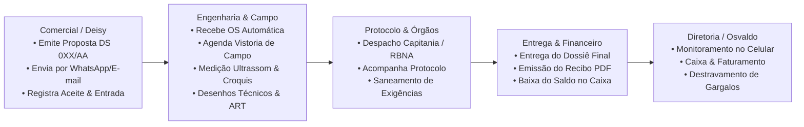

# Nautilus Sistema Integrado de Engenharia Naval
## Apresentação Estratégica & Operacional para Diretoria

---

### Visão Geral: Por que este sistema existe?

Empresas de engenharia naval e consultoria marítima não operam como indústrias comuns ou escritórios de comércio. O dia a dia da **Nautilus Engenharia Naval** envolve:
* **Prazos regulatórios rígidos** com a Marinha do Brasil (Capitania dos Portos / DPC) e Sociedades Classificadoras (RBNA, Amazon Naval, etc.);
* **Operações de campo críticas**, como medição de espessura de solda por ultrassom, planos de segurança, croquis de sondagem e emissão de ARTs;
* **Armadores e clientes exigentes**, que dependem de agilidade para não deixar balsas, empurradores e embarcações parados em porto;
* **Controle financeiro de obras por embarcação**, com entradas de sinal, parcelas intermediárias e quitações após entrega do laudo.

Sistemas genéricos de gestão (ERPs de prateleira) falham porque não conhecem o fluxo naval. Este sistema foi **construído e adaptado exclusivamente para a rotina da Nautilus**, conectando o orçamento comercial, a execução técnica de campo, os protocolos regulatórios e o caixa da empresa em uma única ferramenta integrada.

---

## 1. Os 5 Problemas Reais do Dia a Dia e Como o Sistema Resolve

### Problema 1: Orçamentos demorados e falta de controle de aceites
* **A Realidade:** Orçamentos feitos em editores de texto ou planilhas tomam tempo, correm risco de erro em cálculos e muitas vezes o cliente aceita pelo WhatsApp ou presencialmente e a equipe não sabe se a proposta virou contrato ou se ainda está pendente.
* **A Solução do Sistema:** 
  * Gera a proposta no padrão oficial da Nautilus (**DS 0XX/AA**) em segundos, calculando totais, descontos e prazos automaticamente;
  * Exporta em PDF timbrado profissional com a assinatura digital do responsável já cadastrada;
  * Compartilha diretamente por **E-mail com anexo** ou **WhatsApp oficial** em 1 clique;
  * Possui a tela de **Registro de Aceite Formal**: registra quem aprovou, data, meio (presencial, e-mail ou WhatsApp), anexa o contrato assinado (até 25MB) e já pergunta a situação financeira (sinal, parcial ou a faturar).

---

### Problema 2: Gargalos e Exigências da Capitania / Certificadora que travam a embarcação
* **A Realidade:** Quando um processo dá entrada na Capitania ou Sociedade Classificadora e o perito/vistoriador emite uma exigência técnica, se essa informação ficar na caixa de e-mail de um único funcionário, o prazo corre, a embarcação fica travada e o armador cobra a diretoria.
* **A Solução do Sistema:**
  * Aba de **Protocolos & Entregas** com número do protocolo, órgão destinatário e código de rastreio;
  * Status em tempo real: *Em Trânsito*, *Protocolado*, *Em Análise*, *Com Exigência* e *Concluído*;
  * Se houver **Exigência Externa**, o sistema emite um alerta vermelho imediato no painel da equipe e no celular do diretor, permitindo agir antes que vire atraso crítico.

---

### Problema 3: "Dinheiro na mesa" (Serviço entregue com saldo esquecido)
* **A Realidade:** Em empresas de engenharia, é comum a equipe focar na entrega técnica do laudo e esquecer de checar se o armador quitou a última parcela. Pequenos saldos espalhados por dezenas de embarcações somam dezenas de milhares de reais parados.
* **A Solução do Sistema:**
  * Cada embarcação tem sua ficha financeira consolidada: **Valor Total Contratado**, **Valor Recebido** e **Saldo Pendente** recalculados automaticamente pelo banco de dados;
  * O módulo financeiro separa claramente o que já entrou no banco (via PIX, transferência ou boleto com comprovante anexado) do que está a receber;
  * Emissão de **Recibo Oficial com CNPJ/CPF do armador em PDF** com numeração sequencial para envio imediato após o recebimento.

---

### Problema 4: Falta de visão sobre quem está fazendo o quê
* **A Realidade:** Sem um painel central, o diretor precisa ligar para os técnicos ou para a secretaria a todo momento para saber: *"O relatório de ultrassom da Balsa X já foi desenhado? Quem está com o croqui? A ART já foi recolhida?"*.
* **A Solução do Sistema:**
  * **Ordens de Serviço (OS 0XX/AA)** geradas automaticamente a partir da proposta aprovada;
  * Divisão dos serviços da OS (Ultrassom, Desenhos, Memórias de Cálculo, ART, Relatório de Estabilidade);
  * Cada serviço tem seu responsável técnico, prazo agendado e status (*Pendente*, *Em Execução*, *Revisão Interna*, *Pronto para Envio*);
  * Controle de versionamento de documentos (V1, V2, V3) com histórico de quem aprovou internamente antes do despacho.

---

### Problema 5: Perda de receita recorrente de renovações anuais
* **A Realidade:** Vistorias de espessura de solda e certificados navais possuem validade periódica (geralmente anual). Sem um controle automático, o armador só procura a empresa quando o certificado já venceu ou quando é multado pela Capitania.
* **A Solução do Sistema:**
  * O sistema possui uma rotina inteligente de **Renovações Anuais**: monitora automaticamente todas as embarcações que completaram 1 ano desde o último aceite;
  * Alerta o comercial para entrar em contato com o cliente com antecedência;
  * Permite criar uma nova proposta de renovação vinculada à anterior em 1 clique, garantindo receita recorrente e retenção da carteira de clientes.

---

## 2. Como Funciona a Rotina de Trabalho na Prática

O sistema foi estruturado para que **cada membro da equipe tenha seu foco**, sem sobrecarregar o diretor:

1. **Comercial (Deisy / Administrativo):**
   * Cadastra armadores e embarcações com dados técnicos (Boca, Pontal, Comprimento, Registro);
   * Gera as propostas comerciais no padrão oficial e anexa o contrato formal assinado;
   * Cuida das cobranças de parcelas no Contas a Receber.

2. **Equipe Técnica (Inspetores de Ultrassom & Desenhistas):**
   * Visualizam apenas as ordens de serviço e tarefas atribuídas a eles;
   * Fazem upload dos relatórios de medição, croquis e arquivos técnicos;
   * Sabem exatamente o cronograma de visitas a bordo nos estaleiros e portos.

3. **Logística e Entregas (Lucas / Expedição):**
   * Acompanha quais documentos já foram liberados pela engenharia;
   * Registra o protocolo de entrega final ao cliente e anexa o canhoto/comprovante.

4. **Diretoria (Osvaldo):**
   * **Não precisa preencher formulários no dia a dia;**
   * Utiliza a ferramenta como um **Cockpit de Monitoramento e Decisão**.

---

## 3. A Visão do Dono no Celular: O Cockpit Executivo

Como o diretor passa boa parte do tempo em reuniões, visitas a estaleiros ou em trânsito, a tela inicial para celular foi adaptada para um modelo executivo:

* **Saldo do Caixa em 5 Segundos:** Ao abrir o celular, vê de imediato o saldo total a receber de todos os contratos em aberto e as entradas registradas no mês;
* **Radar de Atenção (Gestão por Exceção):** O sistema só chama a atenção do dono se houver algo crítico — como uma balsa com exigência parada na Capitania há dias ou uma proposta de alto valor aguardando retorno de um armador;
* **Ciclo Naval em Tempo Real:** Mostra visualmente onde estão os projetos da Nautilus: quantas propostas na mesa, quantas vistorias em campo, quantos laudos em elaboração e quantos processos na Capitania;
* **Frota Ativa na Palma da Mão:** Consulta rápida do status de qualquer embarcação atendida pela empresa, quem é o cliente e qual classificadora está acompanhando;
* **Zero Caixas Vazias:** Elimina da tela do diretor informações operacionais irrelevantes para quem está no comando.

---

## 4. O que o Sistema Realmente Possui Implementado (Auditoria Técnica)

Tudo o que está descrito acima **não é promessa futura** — são módulos já codificados, com banco de dados estruturado e em pleno funcionamento na aplicação:

| Módulo / Recurso | O que está ativo e pronto no sistema |
| :--- | :--- |
| **Propostas Comerciais (DS)** | Numeração sequencial oficial, tabela de serviços náuticos, motor de PDF com cabeçalho e assinatura digital, envio por e-mail e WhatsApp. |
| **Aceite Formal** | Registro de responsável, data, meio de aceite, upload de comprovante assinado e integração financeira no ato. |
| **Ordens de Serviço (OS)** | Criação automática após aceite, desmembramento por tipo de serviço, agenda técnica e controle de versões de laudos. |
| **Financeiro Completo** | Contas a Receber por proposta/embarcação, Contas a Pagar por fornecedor, fluxo de caixa, recibos em PDF e anexos fiscais. |
| **Protocolos Externos** | Rastreio de envios para DPC, Capitania e Certificadoras (RBNA, Amazon Naval), com controle de exigências e ciclos de resposta. |
| **Renovações Anuais** | Varredura de certificados que completam 365 dias para reabertura de vistoria periódica. |
| **Controle de Acessos** | Sistema de permissões por perfil (Diretor, Comercial, Técnico, Logística) para segurança dos dados. |
| **Painel Mobile Executivo** | Interface responsiva desenhada sob medida para smartphone, focada em métricas e exceções. |

---

## 5. O Retorno Real do Investimento (ROI na Prática)

O valor de uma ferramenta como essa não está na tecnologia em si, mas no prejuízo que ela evita e na receita que ela recupera:

1. **Recuperação de 1 única parcela esquecida** de um relatório de arqueação ou medição de ultrassom (geralmente entre R$ 3.000 e R$ 15.000) já cobre meses de investimento no sistema;
2. **Eliminação do atraso por exigência da Capitania:** Quando uma exigência é sanada 3 dias mais rápido, o armador não perde a viagem da carga e a Nautilus se consolida como a consultoria mais ágil da região;
3. **Receita recorrente garantida:** Ao lembrar automaticamente das vistorias que vencem a cada 12 meses, a carteira de armadores continua gerando receita todo ano sem que nenhum cliente caia no esquecimento;
4. **Imagem de Engenharia de Primeira Linha:** Propostas com layout padronizado, envio direto no WhatsApp, relatórios com assinatura digital e recibos emitidos no ato transmitem segurança máxima para os clientes.

---

### Conclusão

A **Nautilus Engenharia Naval** já possui uma reputação técnica sólida no mercado marítimo. O sistema é o pilar que faltava para dar a essa operação o mesmo nível de organização interna: processos amarrados, equipe alinhada, dinheiro no caixa e a diretoria com controle total na palma da mão, onde quer que esteja.
